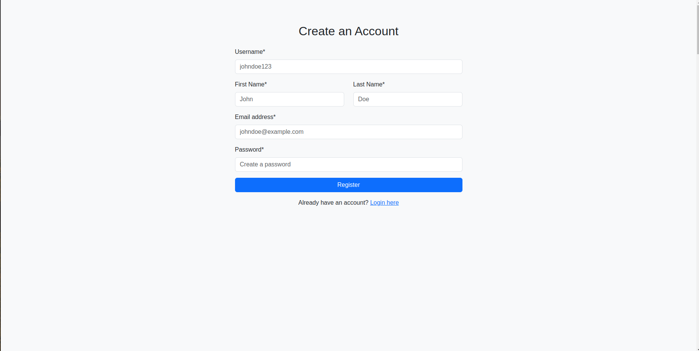
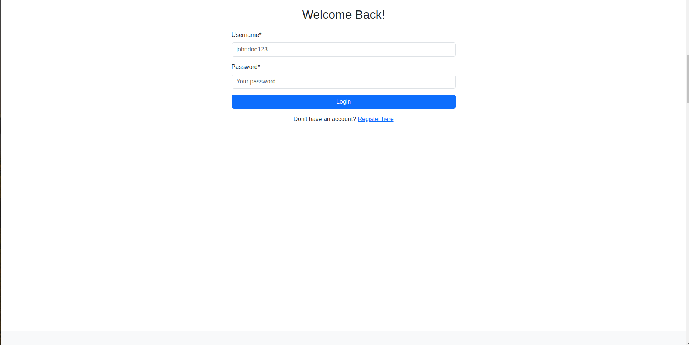
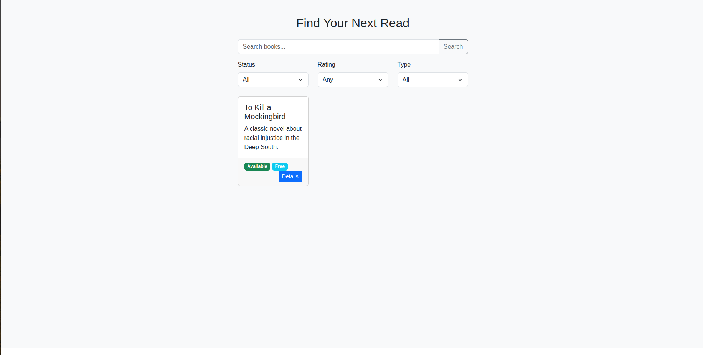
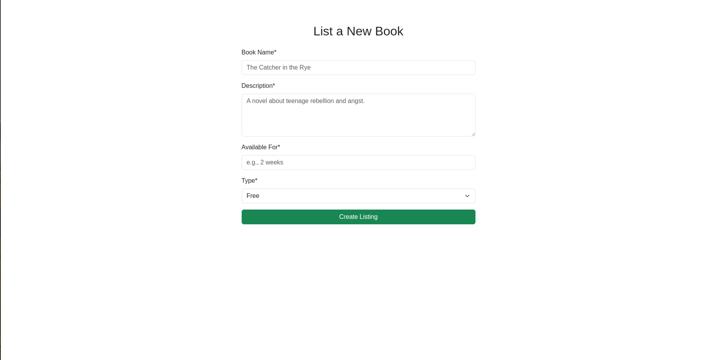
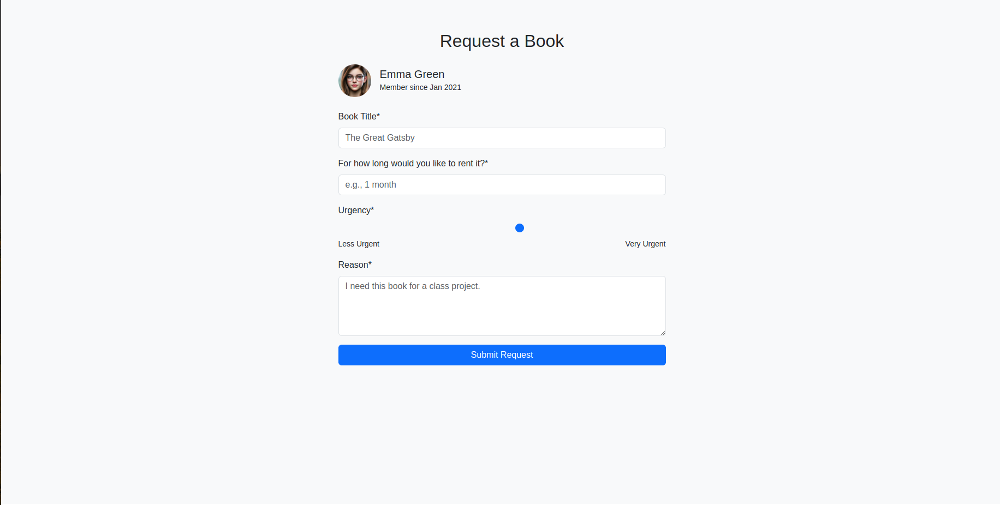
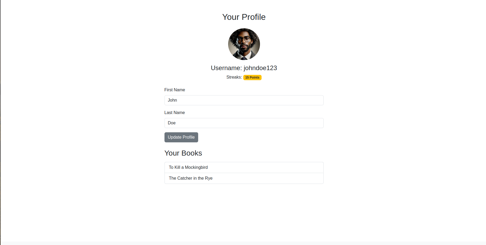
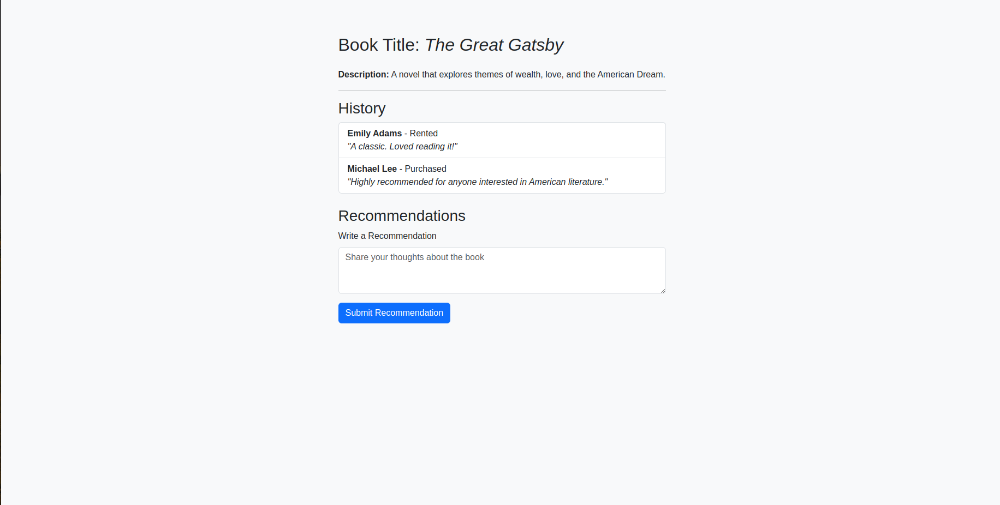
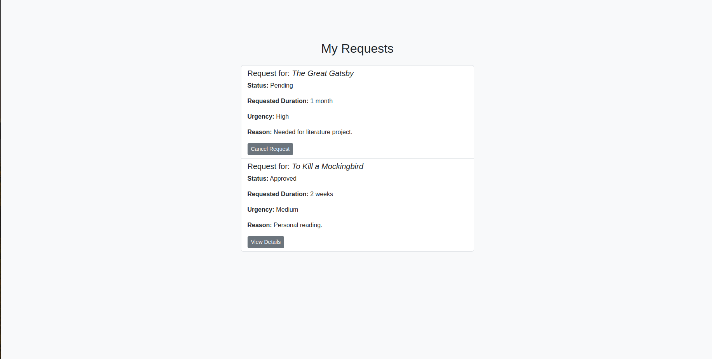
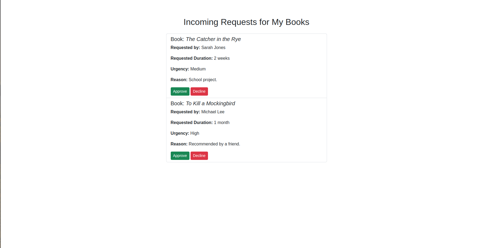
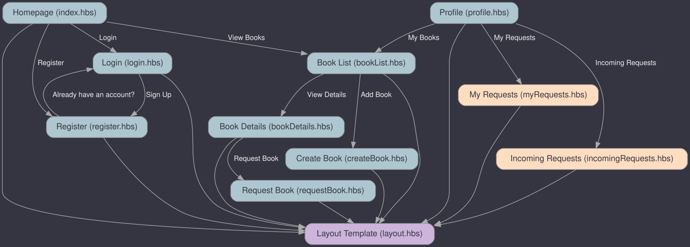

# Book Exchange and Recommendation Platform

## Overview

The **Book Exchange and Recommendation Platform** is a community-driven web application designed to connect book enthusiasts. It allows users to share, borrow, rent, or sell books within a trusted community. Users can register and log in to list books they own, browse available books, request books from others, and leave recommendations and reviews. The platform fosters a collaborative environment where users can discover new reads, share resources, and connect with fellow book lovers.

## Features

- **User Registration and Authentication**: Secure sign-up and login functionalities.
- **Book Listing**: Users can list books they own, specifying details like title, description, availability duration, and exchange type (free, rent, giveaway, sale).
- **Book Browsing and Search**: Browse all available books with search and filtering options based on status, rating, and type.
- **Book Requesting**: Users can request to borrow books, specifying rental duration, urgency, and reason.
- **User Profile Management**: View and edit personal details, profile picture, and manage listed books.
- **Recommendations and Reviews**: Leave and view recommendations for books, enhancing community interaction.
- **Book History**: View past interactions and feedback related to a book.
- **Track My Requests**: Users can view the status of their active requests, including details like book title, request status, requested duration, urgency, and reason. They can also cancel pending requests.
- **Incoming Requests for Posted Books**: Book owners can view incoming requests for the books they’ve posted, along with requestor details and the option to approve or decline requests.

## Data Model

The application will store data for **Users**, **Books**, **Requests**, and **Recommendations** with the following relationships:

- **Users**:
  - Can list multiple books.
  - Can request books from other users.
  - Can leave recommendations for books.
- **Books**:
  - Belong to a user (the owner).
  - Can have multiple requests and recommendations.
  - Maintain a history of past interactions.
- **Requests**:
  - Link a requesting user to a book.
  - Track the status and details of the request.
- **Recommendations**:
  - Link a user to a book they've recommended.
  - Contain the user's feedback and rating.

### Sample Documents

#### User

```json
{
  "username": "johndoe123",
  "firstName": "John",
  "lastName": "Doe",
  "email": "johndoe@example.com",
  "passwordHash": "hashed_password",
  "profilePicture": "profile.webp",
  "streaks": 15,
  "books": ["book_id_1", "book_id_2"],
  "memberSince": "2021-01-15"
}
```

#### Book

```json
{
  "owner": "user_id",
  "title": "The Great Gatsby",
  "description": "A novel exploring themes of wealth, love, and the American Dream.",
  "status": "Available",
  "type": "Rent",
  "duration": "2 weeks",
  "createdAt": "2023-10-15",
  "requests": ["request_id_1"],
  "recommendations": ["recommendation_id_1"],
  "history": ["interaction_id_1"],
  "image": "greatgatsby.jpg"
}
```

#### Request

```json
{
  "book": "book_id",
  "requester": "user_id",
  "rentalDuration": "1 month",
  "urgency": 7,
  "reason": "Needed for a class project.",
  "status": "Pending",
  "requestedAt": "2023-10-16"
}
```

#### Recommendation

```json
{
  "book": "book_id",
  "user": "user_id",
  "text": "Highly recommended for literature enthusiasts.",
  "rating": 5,
  "createdAt": "2023-10-20"
}
```

## [Link to Commented First Draft Schema](src/db.mjs)

## Wireframes

The following wireframes illustrate the main pages for the **Book Exchange and Recommendation Platform**. These images are stored in the `documentation` folder:

1. **Register Page**: A page for new users to sign up by providing their username, first name, last name, email, and password.
   - 

2. **Login Page**: A page for existing users to log in with their username and password.
   - 

3. **Books Page**: Displays a list of all available books, with options to search and filter based on status, rating, and type.
   - 

4. **Create Book Listing Page**: A form for users to add a new book, including fields for the book's name, description, availability duration, and type.
   - 

5. **Request Page**: A form where users can request a book from another user, specifying details like rental duration, urgency, and reason.
   - 

6. **Profile Page**: Shows the user’s profile details, including name, profile picture, and a list of books they have listed.
   - 

7. **Book Details Page**: Provides in-depth information about a specific book, including description, history of interactions, and recommendations. Users can also leave their own recommendation on this page.
   - 

8. **My Requests Page**: Displays the status of all requests made by the user, with the ability to view details or cancel pending requests.
   - 

9. **Incoming Requests for My Books Page**: Shows requests received for the user’s listed books, with options to approve or decline requests.
   - 

## Site Map


## User Stories or Use Cases

1. As a **non-registered user**, I can register a new account by providing my details to access the platform.
2. As a **registered user**, I can log in to access my account.
3. As a **user**, I can create a new book listing, providing details like title, description, availability duration, and exchange type.
4. As a **user**, I can browse and search for books, using filters like status, rating, and type to find books I'm interested in.
5. As a **user**, I can request to borrow or purchase a book by specifying the rental duration, urgency, and reason.
6. As a **user**, I can view and edit my profile information, including updating my personal details and profile picture.
7. As a **user**, I can view the books I have listed and manage them.
8. As a **user**, I can leave a recommendation or review for a book I have read.
9. As a **book owner**, I can view requests for my books and approve or decline them.
10. As a **user**, I can track the status of my active requests, including viewing details and canceling pending requests.
11. As a **book owner**, I can view incoming requests for my books, seeing details such as requester information, urgency, and rental duration, and can approve or decline requests.

## Research Topics

Here's the updated **Research Topics** section in the same format as the README:

---
## Research Topics
- **Using Next.js for Full-Stack Development (10 points)**:
  - **What is it?**  
    Next.js is a powerful React framework that enables server-side rendering (SSR), static site generation (SSG), and API route handling. It supports full-stack development in a unified environment, allowing the platform to handle both frontend and backend needs seamlessly.

  - **Why use it?**  
    - **Unified Framework**: Integrating both backend and frontend in Next.js simplifies development and reduces complexity.
    - **Performance Optimization**: SSR and SSG enhance performance, resulting in faster load times and improved SEO.
    - **Simplified Deployment**: Next.js integrates easily with platforms like Vercel and Docker, which simplifies scaling and deployment.
    - **Modular and Extensible**: Next.js’s plugin architecture supports feature expansions such as authentication, caching, and analytics, making it ideal for dynamic community applications.

  - **List of Possible Candidate Modules or Solutions**:
    - **NextAuth.js**: Provides secure user authentication, supporting OAuth, email/password login, and session management.
    - **SWC (Speedy Web Compiler)**: Enhances performance through fast JavaScript/TypeScript compilation.
    - **Axios or fetch()**: Enables efficient data fetching between the client and server, crucial for functionalities like book listing, browsing, and request handling.
    - **Prisma or Sequelize**: As ORM solutions, they connect Next.js with the database, facilitating optimized relational database management.

- **User Authentication with Passport.js (5 points)**:
  - Implement secure user authentication using Passport.js, including registration, login, logout, and session management.
  - Hash and salt passwords using bcrypt for security.
  - Protect routes to ensure only authenticated users can access certain pages.

- **Automated Functional Testing with Mocha, Chai, and Supertest (5 points)**:
  - Write server-side tests to verify API endpoints and application logic.
  - Test critical functionalities such as user registration, login, book listing, and requesting.
  - Ensure that the API responds correctly to various inputs and edge cases.

- **End-to-End Testing with Cypress (4 points)**:
  - Implement end-to-end tests to simulate user interactions with the application.
  - Validate form submissions, navigation flows, and UI elements.
  - Test the application in different browsers and screen sizes to ensure responsiveness.

**Total Research Points: 24 points (only 10 required)**

## [Link to Initial Main Project File](src/app.mjs)

## Annotations / References Used

1. [Passport.js Documentation](https://www.passportjs.org/docs/) - will be Used for implementing user authentication.
2. [Mocha and Chai Documentation](https://mochajs.org/) - wil be Used for writing server-side tests.
3. [Supertest](https://github.com/visionmedia/supertest) - will be Used for testing HTTP endpoints.
4. [Cypress Documentation](https://docs.cypress.io/) - will be Used for end-to-end testing of the application's UI.
5. [Bootstrap 5](https://getbootstrap.com/docs/5.3/getting-started/introduction/) - will be used for styling and responsive design.
6. [Handlebars.js](https://handlebarsjs.com/) - used for server-side templating.
7. [Express.js](https://expressjs.com/) - Used as the web framework for building the server.